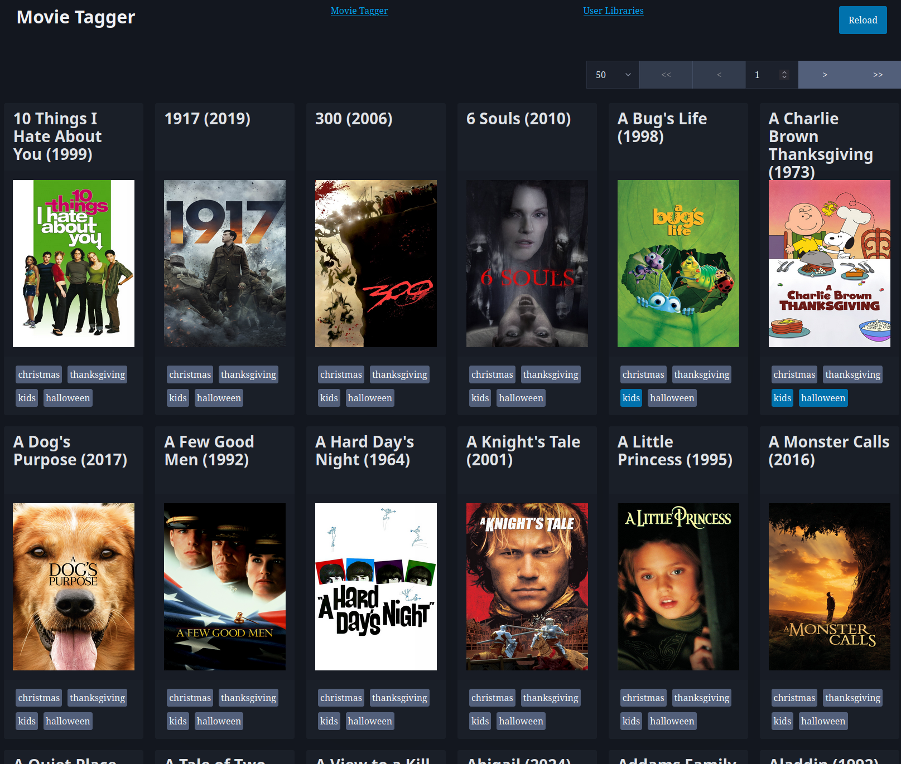
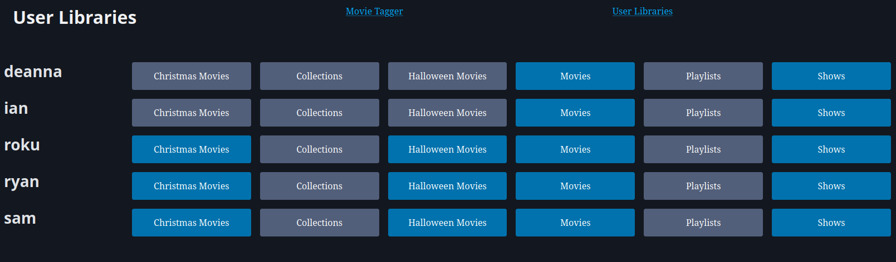

# Tagrs - A simple Jellyfin management micro site

Features:
- [x] Movie collection symlink management
- [x] Single clock user library access

## Usage
1. Clone the repository
2. `cargo build --release`
3. `./target/release/tagrs --movie-dir <movie-dir> --tag-dir <tag-dir>`
